# School_District_Analysis

## Overview
I have analyzed the grades across schools in a district and summarized them at by school, and at the district level. There is doubts as to whether the 9th grade scores from Thomas High School are legitimate, so I have rerun the same analysis without those scores to compare. 

## Results
- How is the district summary affected?
    - Original
        
    - New
        
    - The all the metrics decreased slightly except the average reading score which was unchanged. 
- How is the school summary affected?
    - Original
        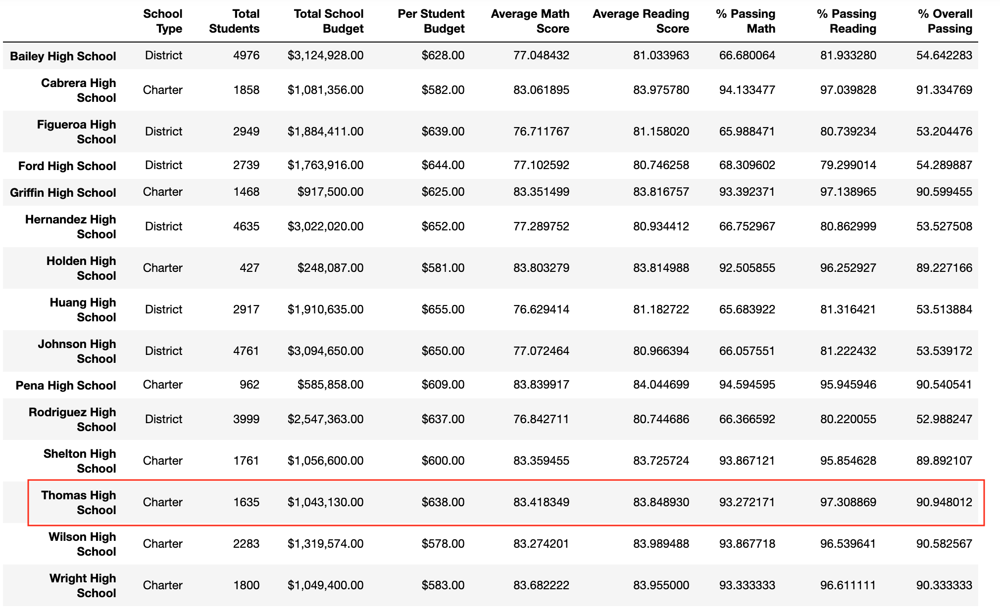
    - New
        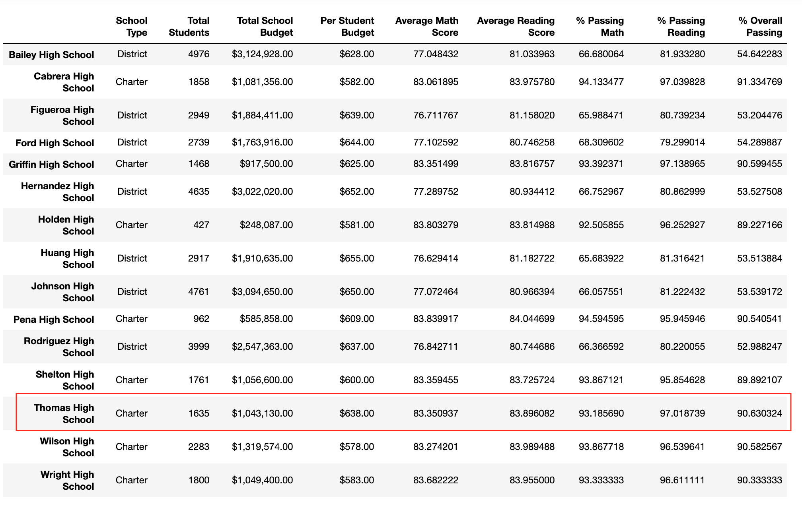
    - Only the Thomas High School numbers were affected.
    - The metrics for Thomas High School decreased slightly except the average reading score which increased very slightly.
- How does replacing the ninth graders' math and reading scores affect Thomas High School's performance relative to the other schools?
    - Original Top Schools
        -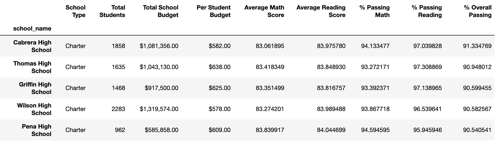
    - New Top Schools
        -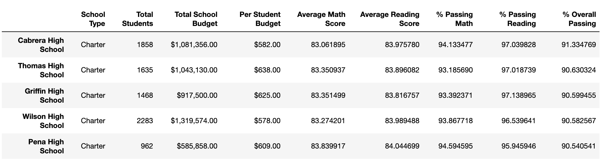
    - The changes were so small that its standing as the 2nd best performing school was unchanged. 
- How does replacing the ninth-grade scores affect the math and reading scores by grade?
    - Original Math Scores by Grade
        -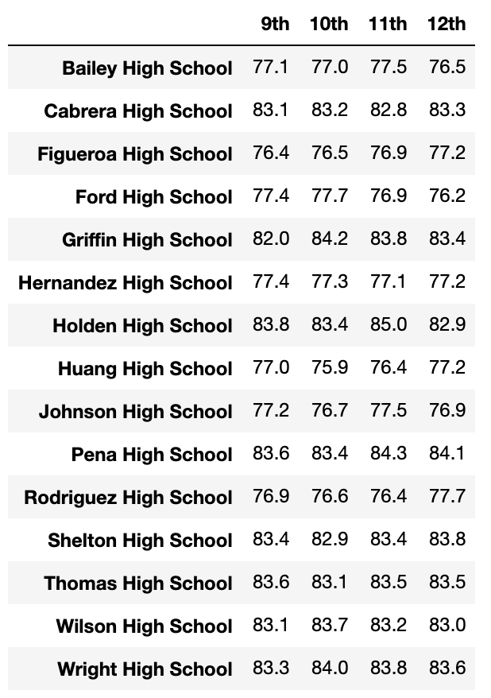
    - New Math Scores by Grade
        -
    - Original Reading Scores by Grade
        -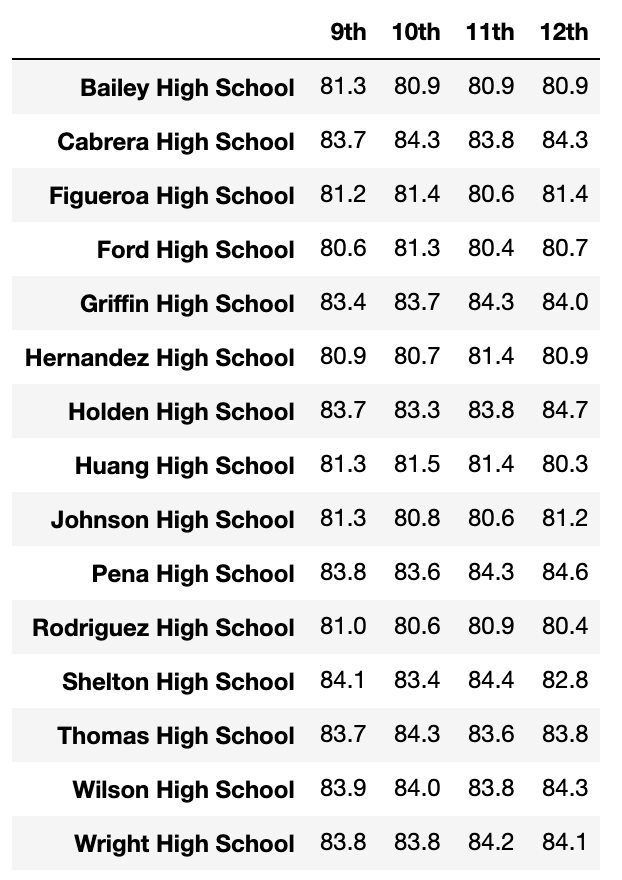
    - New Reading Scores by Grade
        -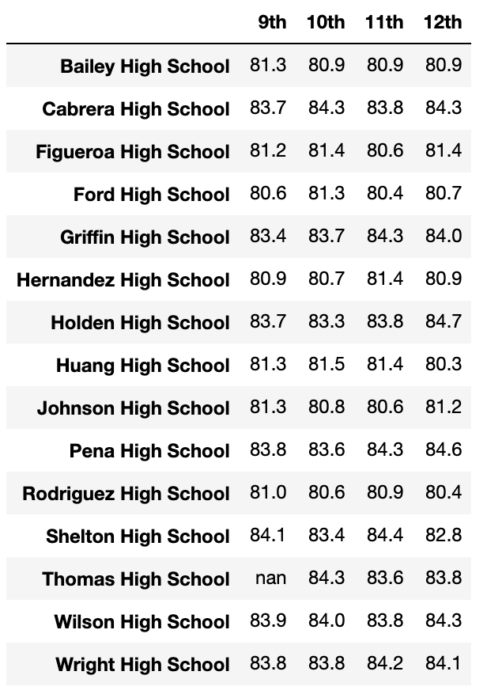
    - The only change is there not being any average scores for the 9th grade at Thomas High School.
- How does replacing the ninth-grade scores affect the scores by school spending?
    - Original
        -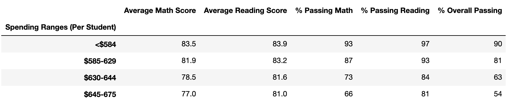
    - New
        -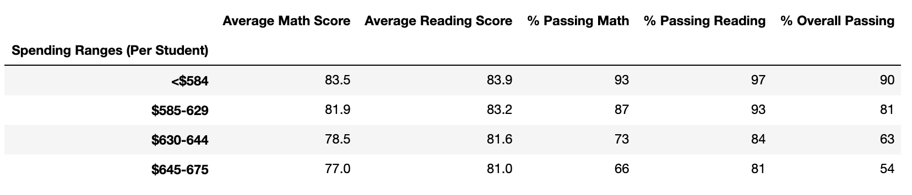
    - There was no change to this summary due to rounding.
- How does replacing the ninth-grade scores affect the scores by school size?
    - Original
        -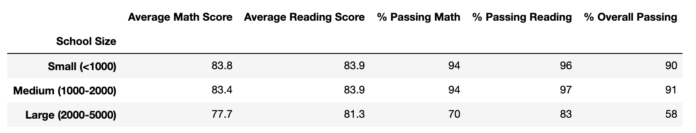
    - New
        -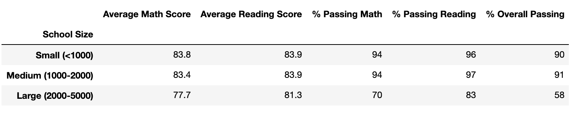
    - There was no change to this summary due to rounding.
- How does replacing the ninth-grade scores affect the scores by school type?
    - Original
        -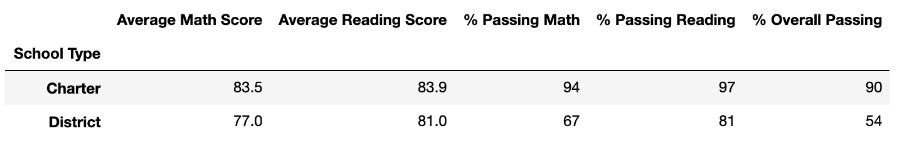
    - New
        -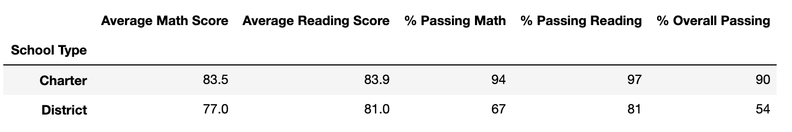
    - There was no change to this summary due to rounding.

## Summary
The most notable changes in the updated school district analysis after removing the ninth-grade scores from Thomas High School are as follows:

1. The average math score for the district decreased by 0.1.
2. The % passing math for the district decreased by 0.2%.
3. The % passing reading for the district decreased by 0.3%.
4. The % overall passing for the district decreased by 0.1%.