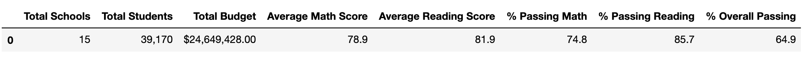

# School_District_Analysis

## Overview
I have analyzed the grades across schools in a district and summarized them at by school, and at the district level. There is doubts as to whether the 9th grade scores from Thomas High School are legitimate, so I have rerun the same analysis without those scores to compare. 

## Results
- How is the district summary affected?
    - Original
        -
    - New
        -
- How is the school summary affected?
    - Original
        -
    - New
        -
- How does replacing the ninth graders' math and reading scores affect Thomas High School's performance relative to the other schools?
    - Original Top Schools
        -
    - New Top Schools
        -
- How does replacing the ninth-grade scores affect the math and reading scores by grade?
    - Original Math Scores by Grade
        -
    - New Math Scores by Grade
        -
    - Original Reading Scores by Grade
        -
    - New Reading Scores by Grade
        -
- How does replacing the ninth-grade scores affect the scores by school spending?
    - Original
        -
    - New
        -
- How does replacing the ninth-grade scores affect the scores by school size?
    - Original
        -
    - New
        -
- How does replacing the ninth-grade scores affect the scores by school type?
    - Original
        -
    - New
        -

## Summary
The most notiable changes in the updated school district analysis after removing the ninth-grade scores from Thomas High School are as follows:

1. 
2. 
3. 
4. 